<!-- Animated profile: SVGs generated by scripts/, refreshed daily by .github/workflows/update-profile-art.yml -->

<h3><code>aria@github ~ $ ./contributions.sh</code></h3>

  

<h3><code>aria@github ~ $ whoami</code></h3>

<table>
<tr>
<td valign="top"></td>
<td valign="top"></td>
</tr>
</table>

<h3><code>aria@github ~ $ cat how-i-built-this.txt</code></h3>

<a href="https://ariacodez.ai/resources/animated-github-profile"><b>ariacodez.ai/resources/animated-github-profile</b></a> — the full build. No widgets, no tokens, no third-party stat services.

